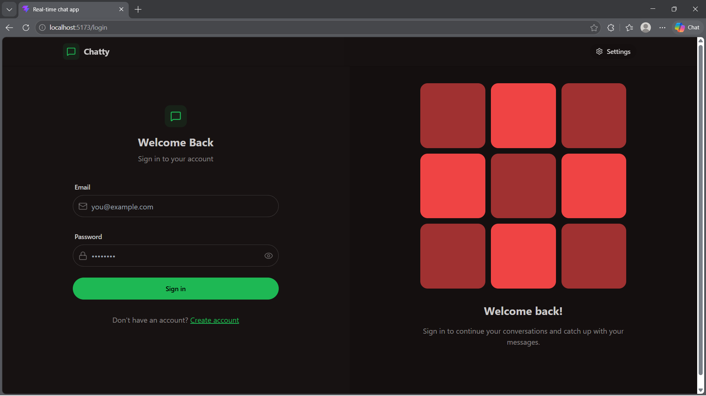
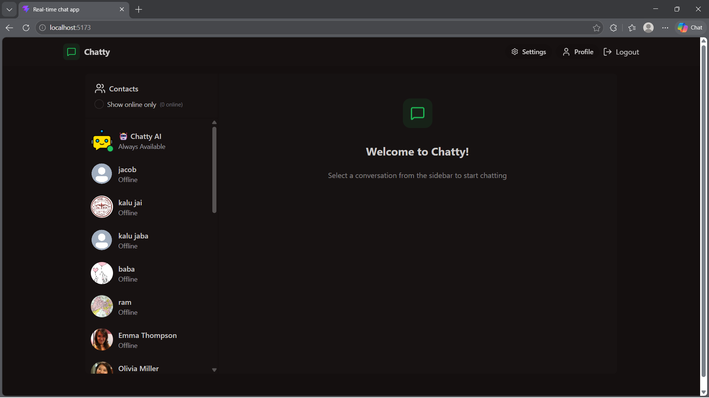
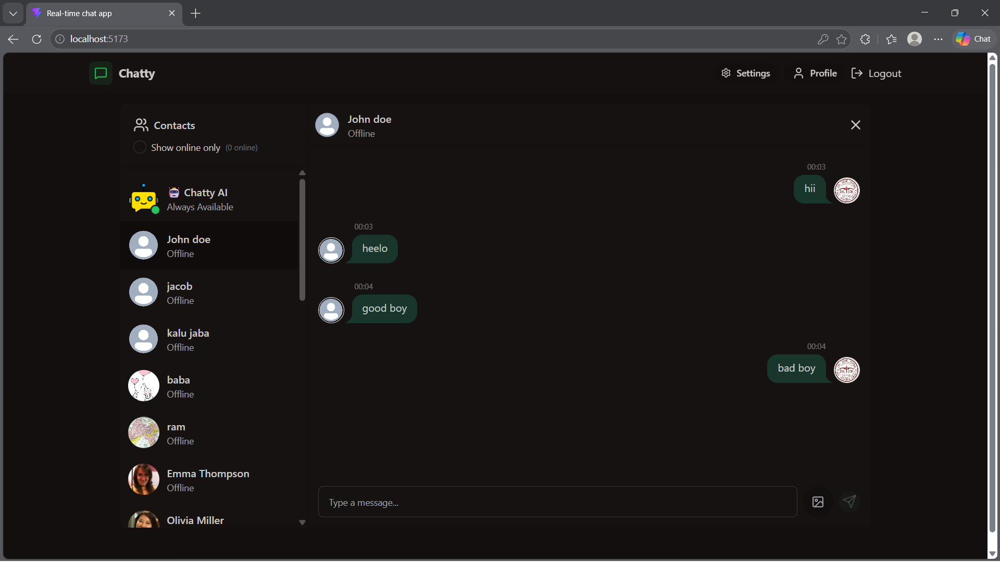
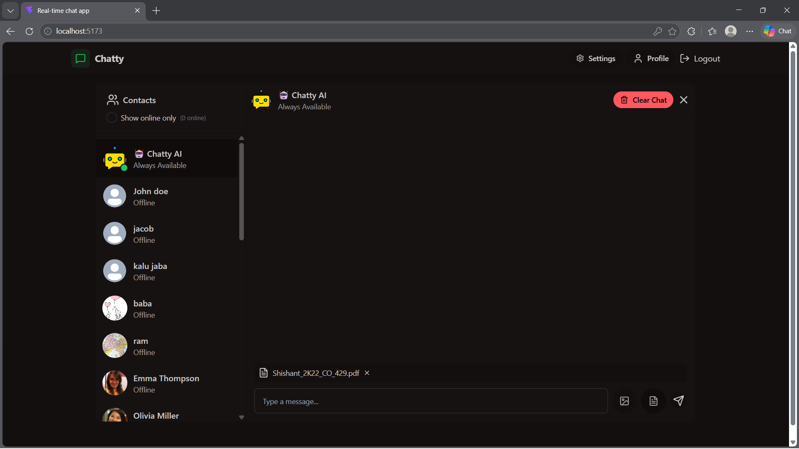
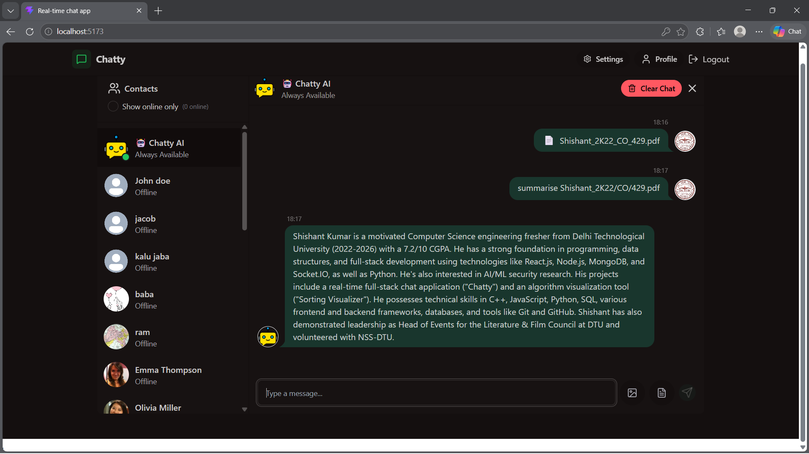

<div align="center">

# 🚀 Chatty AI

### Real-Time Messaging Platform with AI-Powered Document Intelligence

Chatty AI is a production-ready full-stack real-time communication platform that combines human-to-human messaging, conversational AI, and PDF-based knowledge retrieval into a single intelligent workspace. Users can exchange messages instantly, upload documents, maintain persistent conversations, and interact with an AI assistant capable of generating context-aware responses from uploaded content.

<p align="center">


</p>

</div>

---

# 🌐 Live Demo

🔗 **Live Application:** https://realtime-fullstack-chatapp.onrender.com

# 📖 Overview

Chatty AI is a full-stack real-time communication platform that extends traditional messaging with AI-powered document understanding.

Users can:

- Exchange messages instantly through real-time communication.
- Maintain persistent conversation history.
- Upload PDF documents
- Interact with an AI assistant
- Ask questions about uploaded documents
- Generate summaries
- Receive context-aware responses based on document content directly inside the chat experience.

Instead of switching between chat applications, PDF readers, and AI tools, Chatty AI brings everything together into one seamless experience.

---

# 🎯 Problem Statement

Modern communication and knowledge systems are often fragmented.

Users typically need:

- One platform for messaging
- Another for reading documents
- Another for AI assistance

Chatty AI eliminates this fragmentation by combining:

✅ Real-Time Communication  
✅ AI Assistance  
✅ PDF Knowledge Extraction  
✅ Context-Aware Conversations

inside a single application.

---

# ✨ Key Features

## 💬 Real-Time Messaging

- Instant message delivery using Socket.IO.
- Low-latency bidirectional communication.
- Live conversation updates.
- Online user presence tracking.
- Persistent chat history across sessions.

---

## 🤖 AI-Powered Assistant

Chatty AI is integrated directly into the messaging ecosystem as a dedicated chat participant, enabling users to interact with AI as naturally as they would with another user.

- Natural language question answering.
- Concept explanations and learning assistance.
- Interview question generation.
- Content summarization.
- Context-aware responses powered by uploaded documents.

### 📄 Document Intelligence

Users can upload PDF documents and leverage their content during AI conversations.

- Automatic PDF text extraction and processing.
- Persistent document storage.
- Document-aware question answering.
- Summaries, explanations, and knowledge extraction from uploaded content.

#### 🧠 Context-Aware Retrieval

To provide relevant responses, the AI dynamically selects document context based on the user's query.

**Latest Document Retrieval**

Queries such as:

```text
Summarize this PDF
Explain this document
Summarise this
```

automatically use the most recently uploaded document as context.

---

**Document-Specific Retrieval**

Queries such as:

```text
Explain OperatingSystems.pdf

Summarize DBMS Notes.pdf
```

allow the AI to identify and retrieve information from the referenced document.

---

**Intelligent Fallback**

When no document is explicitly mentioned:

- Available documents are evaluated for relevance.
- Appropriate context is injected into the prompt.
- The AI generates document-aware responses whenever possible.

---

## 🔐 Authentication & Security

- JWT-based authentication.
- Protected application routes.
- Secure password hashing with bcrypt.
- User-specific data and document ownership.
- Secure session management.

---

## 👤 User Management

- User registration and login.
- Profile customization and profile pictures.
- Online/offline status tracking.
- Personalized user experience.

---
## ☁️ Cloud Storage & Media Management

- Cloudinary-powered media storage.
- Secure image uploads and Profile Picture Managment.
- Optimized asset management.
- Reliable cloud-hosted media delivery.

## 💾 Persistent Data Storage

- User account management.
- Conversation history storage.
- Document storage and retrieval.
- Session continuity across visits.

---

## 🚀 Production-Ready Deployment

- Fully deployed on Render.
- MongoDB Atlas integration.
- Environment-based configuration.
- Scalable client-server architecture.
- Production build and deployment workflow.


# 🏗️ System Architecture

```text
                     ┌────────────────────┐
                     │    React Client    │
                     └─────────┬──────────┘
                               │
                    HTTP + Socket.IO
                               │
                               ▼
                  ┌────────────────────────┐
                  │   Node.js + Express    │
                  └─────────┬──────────────┘
                            │
        ┌───────────────────┼───────────────────┐
        │                   │                   │
        ▼                   ▼                   ▼

   MongoDB Atlas       Gemini AI          Cloudinary

      Users         AI Responses         Media Files
      Messages
      Documents
```

---

# 🤖 AI Workflow

```text
      User Message / PDF Upload
                    │
                    ▼
            React Frontend
                    │
                    ▼
           Express.js API Layer
                    │
        ┌───────────┴───────────┐
        │                       │
        ▼                       ▼
 Message Handling      PDF Processing
                        (Multer + PDF Parse)
        │                       │
        └───────────┬───────────┘
                    ▼
              MongoDB Atlas
      (Users • Messages • Documents)
                    │
                    ▼
       Document Context Selection & Prompt Construction
                    │
                    ▼
            Gemini 2.5 Flash
                    │
                    ▼
          Context-Aware AI Response
                    │
                    ▼
       Socket.IO Real-Time Updates
                    │
                    ▼
               User Interface
```

---

# 📂 Project Structure

```text
chat-app
│
├── backend
│   ├── controllers
│   ├── routes
│   ├── models
│   ├── middleware
│   ├── services
│   ├── lib
│   └── seeds
│
├── frontend
│   ├── src
│   │   ├── components
│   │   ├── pages
│   │   ├── store
│   │   ├── lib
│   │   └── constants
│   │
│   └── public
│
└── README.md
```

---

# 🛠️ Tech Stack

| Layer | Technologies |
|---------|-------------|
| Frontend | React 19, Vite, React Router |
| State Management | Zustand |
| UI & Styling | Tailwind CSS, DaisyUI |
| Backend | Node.js, Express.js |
| Database | MongoDB Atlas, Mongoose |
| Authentication | JWT, bcrypt |
| Real-Time Communication | Socket.IO |
| AI Integration | Google Gemini 2.5 Flash |
| Document Processing | PDF Parse |
| File Handling | Multer |
| Cloud Services | Cloudinary |
| Deployment | Render |
| Development Tools | Git, GitHub |

---

# 🚀 Deployment

The application is deployed using Render.

Deployment architecture:

```text
Render
   │
   ├── Backend (Node.js)
   │
   ├── Frontend Build (Vite)
   │
   └── MongoDB Atlas
```

Production build process:

```bash
npm install --prefix backend
npm install --prefix frontend
npm run build --prefix frontend
npm start --prefix backend
```

Highlights:

- Production-ready deployment
- Environment-based configuration
- Frontend served through backend
- MongoDB Atlas integration
- Cloudinary media hosting

---

# ⚙️ Local Setup

## Clone Repository

```bash
git clone https://github.com/shishantkr1408/Realtime_fullStack_ChatApp.git
```

```bash
cd Realtime_fullStack_ChatApp
```

---

## Install Dependencies

```bash
npm install

npm install --prefix backend

npm install --prefix frontend
```

---

## Environment Variables

Create:

```env
backend/.env
```

Example:

```env
PORT=5001

MONGODB_URI=your_mongodb_uri

JWT_SECRET=your_jwt_secret

GEMINI_API_KEY=your_gemini_api_key

CLOUDINARY_CLOUD_NAME=your_cloud_name
CLOUDINARY_API_KEY=your_api_key
CLOUDINARY_API_SECRET=your_api_secret
```

---

## Run Backend

```bash
cd backend

npm run dev
```

---

## Run Frontend

```bash
cd frontend

npm run dev
```

---

# 🧩 Engineering Decisions

## 🤖 AI as a First-Class Chat Participant

Instead of building a separate AI interface, the assistant was integrated directly into the existing messaging ecosystem as a dedicated chat participant.

Benefits:

- Natural conversational experience
- Unified user interface
- Reusable messaging infrastructure
- Consistent chat history and persistence

---

## ⚡ Real-Time Communication with Socket.IO

Socket.IO powers low-latency, bidirectional communication across the platform.

Benefits:

- Instant message delivery
- Live conversation updates
- Online user presence tracking
- Responsive user experience

---

## 📄 Lightweight Document-Aware AI Workflow

Rather than introducing a vector database, the application currently uses a lightweight retrieval approach:

- PDF text extraction and processing
- Dynamic document selection
- Context injection during prompt construction

This keeps the architecture simple while enabling document-aware AI responses based on uploaded content.

---

## 🚀 Production-Ready Deployment

The platform is deployed using a modern cloud-based architecture:

- Render for application hosting
- MongoDB Atlas for database management
- Cloudinary for media storage

This enables a fully deployed, scalable, and accessible application beyond a local development environment.

---

## 🧠 Gemini-Powered Conversational Intelligence

Google Gemini 2.5 Flash was selected as the underlying language model due to its strong balance of speed, contextual understanding, and conversational capabilities.

Benefits:

- Fast response generation
- Context-aware interactions
- Efficient handling of document-assisted conversations
- Improved user experience in real-time chat scenarios

---

# 📈 Skills Demonstrated

This project showcases experience with:

- Full-Stack Development
- REST API Design
- Real-Time Systems
- Authentication & Authorization
- Database Design
- State Management
- AI Integration
- Prompt Engineering
- PDF Processing
- Cloud Deployment
- Production Hosting
- System Design
- Scalable Application Architecture

---

# 📈 Future Improvements

The current platform provides real-time messaging, AI-powered conversations, and PDF-based document understanding. Future iterations could expand both its AI capabilities and collaborative features.

## 🧠 Advanced AI & Knowledge Retrieval

- Vector Database Integration
- Embedding-Based Semantic Search
- Full Retrieval-Augmented Generation (RAG) Pipeline
- Multi-Document Retrieval & Reasoning
- AI Conversation Memory
- OCR Support for Scanned PDFs
- Advanced Context Ranking & Retrieval Strategies

---

## 🤝 Collaboration & Communication

- Group Chats
- Team Workspaces
- Shared Knowledge Repositories
- Collaborative Document Discussions
- Knowledge Sharing Channels

---

## 🚀 Platform Enhancements

- Streaming AI Responses
- Advanced Search Across Chats & Documents
- Analytics & Usage Dashboard
- Real-Time Notifications
- Mobile Optimization
- Progressive Web App (PWA) Support
- Enhanced Performance & Scalability Improvements

---

# 📸 Screenshots

### Login Page

```md

```
### Home Page

```md

```

### Chat Interface

```md

```

### PDF Upload

```md

```

### AI Responses

```md

```

---

# 👨‍💻 Author

## Shishant Kumar

Full-Stack Developer | AI Applications | Software Engineering

GitHub:

```text
https://github.com/shishantkr1408
```

---

⭐ If you found this project interesting, consider giving it a star.